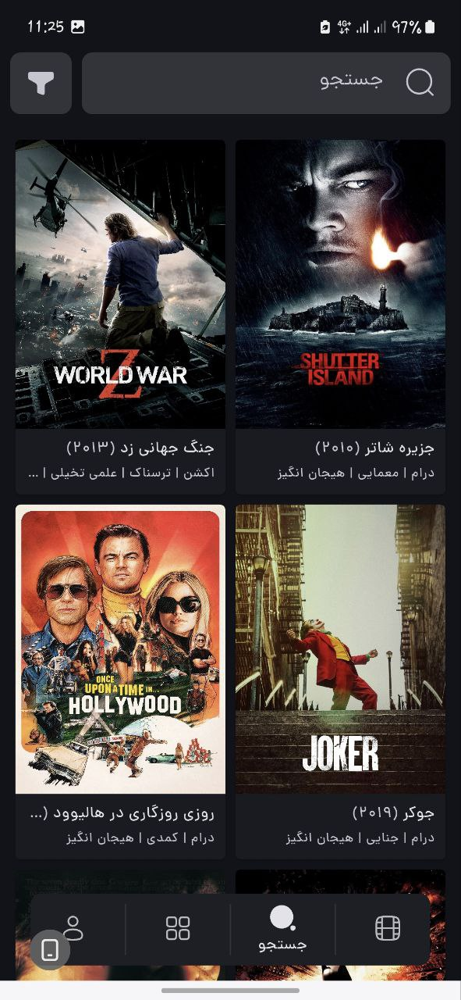
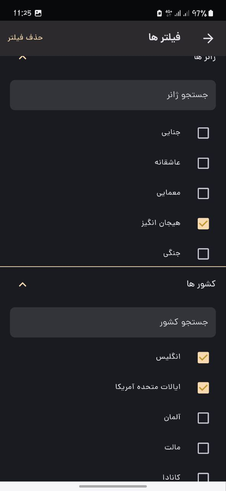
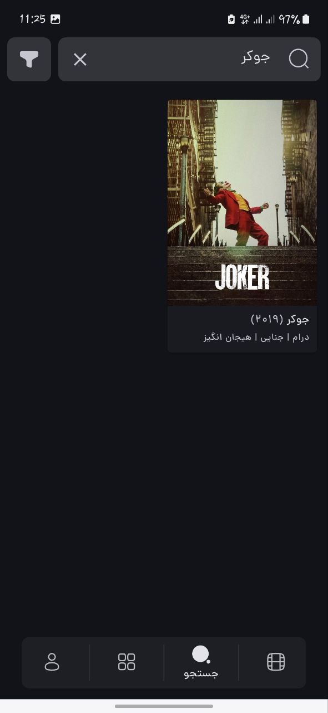
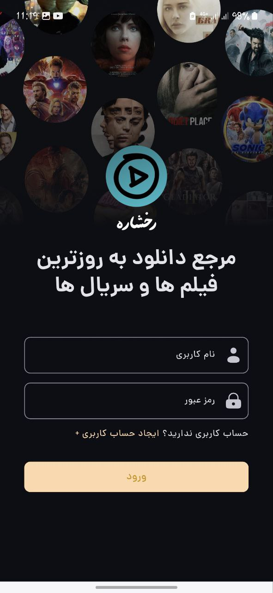
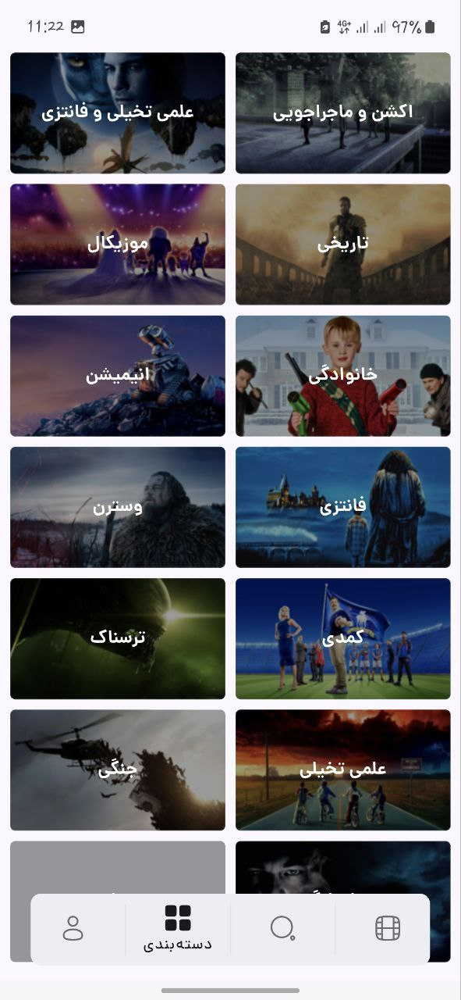
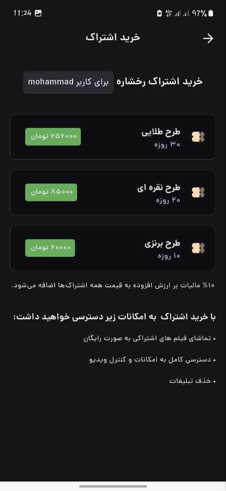
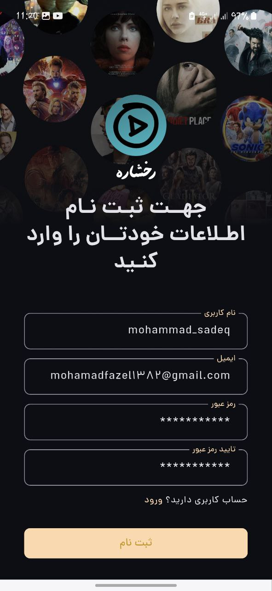

<h1 align="center">📱 Rokhshare Mobile App</h1>

A Flutter-based movie streaming app using MVVM architecture and BLoC for state management

---

## 📖 Overview

The **Rokhshare Mobile App** is the official mobile application of the Rokhshare streaming platform.  
It is built using **Flutter**, follows a clean **MVVM architecture**, and uses **BLoC** for scalable and testable state management.

This app connects to the Rokhshare Django backend via RESTful APIs and allows users to explore, watch, and interact with a wide variety of movies and series.

## 🧩 Related Repositories

- 🌐 **Panel Admin** (Flutter): [Panel Admin Repository Link](https://github.com/Mohammadfazel03/rokhshare-dashboard)
- 🎬 **Backend** (Django): [Backend Repository Link](https://github.com/Mohammadfazel03/rokhshare)

## 🎯 Features

- 🔐 **Authentication**: User login and signup
- 🎬 **Watch movies and series**: Stream video content within the app
- 🧠 **Advanced search**: Find titles with filters and full-text search
- 📝 **Descriptions & galleries**: See full details, screenshots, and posters
- 💬 **Comments & reviews**: Read and post user opinions
- 💳 **Subscription system**: Buy and manage streaming subscriptions
- 🎥 **Watch ads**: Access some content by watching rewarded ads
- 💡 **MVVM + BLoC**: Scalable and testable Flutter architecture
- 🌗 **Light & Dark themes** for better user experience

## 🧱 Tech Stack

- **Flutter** 3.x
- **Dart**
- **BLoC** for state management
- **MVVM** architecture
- **Dio** for HTTP requests
- **Shared Preferences** for local storge 
- **GetIt** for dependeny injection
- **Flutter Secure Storage** for auth tokens
- **Cached Network Image**, **Video Player**, etc.

## 📱 Mobile App UI Showcase

 

  
